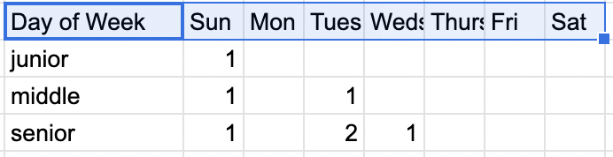

# Lookup Table Swords - Commission Sales

In this example we have a used car company that offers commissions based on three factors: seniority, vehicle level, and day of the week. 

* There are three levels of seniority: junior, middle, and senior. 
* The vehicle breakdowns are low-end, mid-price, full-price, and luxury-price. 
* Finally, there is a bonus for selling on the off-sales days of Tuesday or Wednesday.

For each of the classes of sales people commissions are made:
* For junior sales people, a straight commission of 3% is made regardless of the other factors. 
* For middle sales people commission is based on the price of car sold: 
    * 3% for $0 - $2500, 
    * 5% for others. 
* And senior sales people get 
    * 3% for $0 - $2500, 
    * 5% for $2500 - $10,000, 
    * 8% for $10,000 - $25,000, 
    * and 10% for cars over $25,000.

Finally, as an incentive to bring in more sales on off-sales days:
* Tuesday sales
    * middle sales people get an additional 1%
    * senior sales people get an additional 2%
* Wednesday sales
    * senior sales people get an additional 1%

## The Hydra - Baseline

```python
def commission_sales(seller, price, day):
    # seller: 0=junior, 1=medium, 2=senior
    # price: 0-$100,000
    # day: 0=sun, 1=mon, 2=tues, 3=weds, 4=thurs, 5=fri, 6=sat
    commission = 0
    if seller == 0: 
        commission = 3
    elif seller == 1:
        if price < 2500: commission = 3
        else: commission = 5
        if day == 2: commission += 1
    elif seller == 2:
        if price < 2500: commission = 3
        elif price < 10000: commission = 5
        elif price < 25000: commission = 8
        else: commission = 10
        if day == 2: commission += 2
        elif day == 3: commission += 1
    return commission
```
## The Sword - Lookup Tables: Basic


```python
commission = [
    [3,	3,	3,	3],
    [3,	5,	5,	5],
    [3,	5,	8,	10]
]

bonus = [
    [0,	0,	0,	0,	0,	0,	0],
    [0,	0,	1,	0,	0,	0,	0],
    [0,	0,	2,	1,	0,	0,	0]
]

def commission_sales(level, price, day):
    p = 0
    if price >= 2500: p += 1
    if price >= 10000: p += 1
    if price >= 25000: p += 1
    return commission[level, p] + bonus[level, day]
```

## The Hydra - Updated Commissions

The baseline commission breakdown is quite arcane. If anything would change, it would be difficult to update the logic. In this case, we're going to change the price breakdown for cars between $2500 and $5000 middle sales reps get 4% and senior sales reps get 4.5%. Also, everyone gets an additional 1% for sales on Sundays. These changes require a practical rewriting of the logic. Additionally, this logic can be hard to follow.

```python
def commission_sales(seller, price, day):
    # seller: 0=junior, 1=medium, 2=senior
    # price: 0-$100,000
    # day: 0=sun, 1=mon, 2=tues, 3=weds, 4=thurs, 5=fri, 6=sat
    commission = 0
    if seller == 0: 
        commission = 3
    elif seller == 1:
        if price < 2500: commission = 3
        elif price < 5000: commission = 4.5
        else: commission = 5
        if day == 2: commission += 1
    elif seller == 2:
        if price < 2500: commission = 3
        elif price < 5000: commission = 4.5
        elif price < 10000: commission = 5
        elif price < 25000: commission = 8
        else: commission = 10
        if day == 2: commission += 2
        elif day == 3: commission += 1
    if day == 0: commission += 1
    return commission
```

## The Sword - Truth Tables: Updated




```python
commission = [
    [3,	3,	1,   3,	3],
    [3,	5,	4,5, 5,	5],
    [3,	5,	4.5, 8,	10]
]

bonus = [
    [1,	0,	0,	0,	0,	0,	0],
    [1,	0,	1,	0,	0,	0,	0],
    [1,	0,	2,	1,	0,	0,	0]
]

def commission_sales(level, price, day):
    p = 0
    if price >= 2500: p += 1
    if price >= 5000: p += 1
    if price >= 10000: p += 1
    if price >= 25000: p += 1
    return commission[level, p] + bonus[level, day]
```